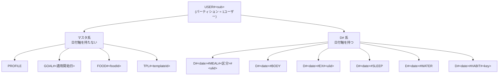
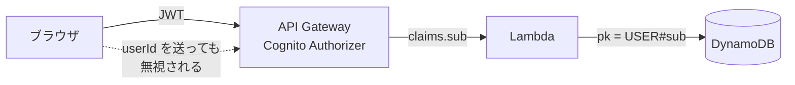

# 設計書: database（データモデル基盤）

> **このファイルはデータモデルの SSOT（Single Source of Truth）である。**
>
> - 新しいエンティティを追加するときは、機能 Spec より先にこのファイルを更新する
> - 各機能 Spec の Data Models セクションはこのファイルを参照するだけにし、構造を書き写さない
> - SK 命名規則から外れる設計が必要になった場合は、実装せずまず相談する

---

## 1. 設計の起点

このアプリのアクセスは**日付軸が主軸**である。ホーム画面で「今日の状態」を一目で出すことが
最優先要件（requirements.md 要件2）なので、**SK の先頭を日付にする**ことで1クエリで賄う。

この規則を崩すと「今日の全データを1クエリ」が成立しなくなる。最も守るべき規則である。

## 2. テーブル構成

| 項目 | 値 | 理由 |
|---|---|---|
| テーブル数 | 1 | シングルテーブル設計 |
| PK 属性名 | `pk` | 汎用名。エンティティ種別に依存しないため |
| SK 属性名 | `sk` | 同上 |
| 課金モード | オンデマンド（PAY_PER_REQUEST） | 利用しない時期があっても課金ゼロに近い |
| GSI / LSI | **なし** | 全アクセスパターンを PK/SK で賄える。コスト増を避ける |
| 暗号化 | AWS 所有キー（デフォルト） | 顧客管理 KMS キーは $1/月/キーで予算の15%を占める |
| PITR | 有効 | S3 エクスポートの前提条件。3MB 規模ではコストは無視できる |
| 削除保護 | 有効 | 蓄積データの誤削除防止 |
| RemovalPolicy | RETAIN | スタック削除時もテーブルを残す |
| Streams | 無効 | 現時点で用途がない |
| Contributor Insights | 無効 | 追加課金が発生する |
| TTL | 未設定 | 生活記録は自動削除しない |

## 3. キー一覧



| エンティティ | PK | SK | 担当 Spec | 状態 |
|---|---|---|---|---|
| プロフィール | `USER#<sub>` | `PROFILE` | auth-login | 未実装 |
| 目標値 | `USER#<sub>` | `GOAL#<適用開始日>` | goal | 未実装 |
| ユーザー登録食品 | `USER#<sub>` | `FOOD#<foodId>` | food-master | 未実装 |
| いつもの食事 | `USER#<sub>` | `TPL#<templateId>` | （将来） | 未実装 |
| 食事 | `USER#<sub>` | `D#<date>#MEAL#<区分>#<ulid>` | meal-log | 未実装 |
| 体重・体脂肪 | `USER#<sub>` | `D#<date>#BODY` | body-record | 未実装 |
| 運動 | `USER#<sub>` | `D#<date>#EX#<ulid>` | exercise-log | 未実装 |
| 睡眠 | `USER#<sub>` | `D#<date>#SLEEP` | （将来） | 未実装 |
| 水分・カフェイン | `USER#<sub>` | `D#<date>#WATER` | （将来） | 未実装 |
| 自由習慣 | `USER#<sub>` | `D#<date>#HABIT#<key>` | （将来） | 未実装 |

### キー命名規則

- `<sub>` は Cognito の `sub` クレーム（UUID）
- `<date>` は **JST 基準**の `YYYY-MM-DD`。ゼロ埋め必須（文字列ソートが日付順になることが前提）
- `<区分>` は `breakfast` / `lunch` / `dinner` / `snack`
- `<ulid>` は ULID（辞書順が生成時刻順になるため、同日内の並び順が自然になる）
- **1日1件のエンティティ**（BODY / SLEEP / WATER）は `<ulid>` を付けない → 同日再登録は upsert
- **1日複数件のエンティティ**（MEAL / EX）は `<ulid>` を付ける
- `D#` プレフィックスにより、日付軸データとマスタ系が SK 空間上で分離される

### 日付の扱い（要件5）

**日付は JST 基準で決定する。UTC を使ってはいけない。**
UTC 基準だと日本時間の午前9時前に記録したものが前日扱いになる。
食事記録アプリで日付がずれるのは致命的な不具合になる。

## 4. アクセスパターン

| # | 用途 | クエリ | 担当 Spec |
|---|---|---|---|
| A1 | 今日の全データ（ホーム画面） | `pk = USER#<sub>` AND `begins_with(sk, "D#<today>")` | home-dashboard |
| A2 | 特定日の特定種別 | `pk = USER#<sub>` AND `begins_with(sk, "D#<date>#MEAL")` | meal-log |
| A3 | 期間指定（7/30/90日） | `pk = USER#<sub>` AND `sk BETWEEN "D#<from>" AND "D#<to>~"` | body-record など |
| A4 | 現在有効な目標値 | `pk = USER#<sub>` AND `sk BETWEEN "GOAL#" AND "GOAL#<today>~"`、降順、Limit 1 | goal |
| A5 | 目標値の履歴 | `pk = USER#<sub>` AND `begins_with(sk, "GOAL#")` | goal |
| A6 | ユーザー登録食品の一覧 | `pk = USER#<sub>` AND `begins_with(sk, "FOOD#")` | food-master |
| A7 | プロフィール取得 | `pk = USER#<sub>` AND `sk = "PROFILE"`（GetItem） | auth-login |

### 設計上の注意

- **A3 は指定期間の全エンティティ種別を取得する。** 体重だけが必要な場合も食事や運動が
  含まれて返る。90日分の全種別で約1,700アイテム・500KB程度であり、DynamoDB の
  1ページ上限1MB に収まるため、この非効率は許容する。
  種別で絞り込む必要がある場合は取得後にコード側でフィルタする
- **A3 の終端文字**: `~`（チルダ, U+007E）は ASCII 上 `#`（U+0023）より大きいため、
  `D#<to>` 配下のアイテムをすべて含められる。かつ `D#<to+1日>` より小さい
- **A4 で上限だけを指定してはいけない。** `sk <= "GOAL#<date>"` と書くと
  `FOOD#`（`F` < `G`）や `D#`（`D` < `G`）のアイテムも条件を満たしてしまう。
  必ず下限も `GOAL#` で閉じた `BETWEEN` にする
- **キーに埋め込む値に `#` と `~` を含めてはいけない。** 含めるとキー構造が壊れ、
  他ユーザーのデータを指すキーを組み立てられる恐れがある（キーインジェクション）。
  キービルダーが検証する
- **Scan は使わない。** Query で設計できないアクセスパターンが必要になった場合は、
  キー設計自体を見直す（この design.md を更新する）

## 5. エンティティ構造

型定義のみを示す。実装はこれを満たすこと。

### 共通属性

```typescript
interface BaseItem {
  pk: string;              // USER#<sub>
  sk: string;              // エンティティごとの規則に従う
  type: EntityType;        // 取得後のフィルタ用
  createdAt: string;       // ISO 8601
  updatedAt: string;       // ISO 8601
}

type EntityType =
  | "PROFILE" | "GOAL" | "FOOD" | "TPL"
  | "MEAL" | "BODY" | "EX" | "SLEEP" | "WATER" | "HABIT";
```

`type` 属性を持つ理由: A3 の期間クエリは複数種別が混在して返るため、
SK のパースではなく属性で判別できるようにする。

### 食事（MEAL）

```typescript
interface Nutrition {
  kcal: number;
  protein: number;   // g
  fat: number;       // g
  carb: number;      // g
}

interface MealItemEntry extends Nutrition {
  name: string;
  amount: number;
  unit: "g" | "ml" | "個" | "枚" | "杯";
  foodRef: string | null;   // 由来の記録用。集計には使わない
}

interface MealItem extends BaseItem {
  type: "MEAL";
  date: string;                          // YYYY-MM-DD (JST)
  mealType: "breakfast" | "lunch" | "dinner" | "snack";
  items: MealItemEntry[];
  totals: Nutrition;                     // items の合計（書き込み時に確定）
}
```

**設計上の重要な決定**

- **食事の品目を別アイテムに分離せず、配列として埋め込む。**
  1食は多くて10品程度で、DynamoDB の1アイテム上限400KBには届かない。
  1回の読み書きで1食が完結し、JOIN に相当する処理が不要になる
- **栄養値は書き込み時のスナップショット**（要件4）。`foodRef` は「どのマスタ由来か」の
  記録用であり、集計には使わない。マスタを後から編集しても過去の記録は変わらない
- `totals` も書き込み時に確定させる。読み取り時に再計算しない

### 体重・体脂肪（BODY）

```typescript
interface BodyItem extends BaseItem {
  type: "BODY";
  date: string;              // YYYY-MM-DD (JST)
  weight: number | null;     // kg
  bodyFat: number | null;    // %
}
```

1日1件。同日の再登録は upsert（SK に ulid を含まないため自然に上書きになる）。

### 目標値（GOAL）

```typescript
interface GoalItem extends BaseItem {
  type: "GOAL";
  effectiveFrom: string;         // YYYY-MM-DD (JST)
  kcal: number | null;
  protein: number | null;
  fat: number | null;
  carb: number | null;
  targetWeight: number | null;
}
```

**履歴として保持する。** 目標は変わるため、過去を振り返るときに「当時の目標」が
分かるようにする。現在有効な目標は A4 で取得する。

### ユーザー登録食品（FOOD）

```typescript
interface FoodItem extends BaseItem, Nutrition {
  type: "FOOD";
  foodId: string;                    // ULID
  name: string;
  baseAmount: number;                // 栄養値が何単位あたりか（通常100）
  baseUnit: "g" | "ml" | "個" | "枚" | "杯";
  source: "user" | "mext";           // 自前登録 / 成分表由来
  externalId: string | null;         // 成分表の食品番号など
}
```

`source` と `externalId` を持つ理由: 後フェーズで日本食品標準成分表を取り込むときに、
自前登録データと外部由来データを区別できるようにする。

### 運動（EX）

```typescript
interface ExerciseItem extends BaseItem {
  type: "EX";
  date: string;                  // YYYY-MM-DD (JST)
  name: string;                  // 例: 腕立て伏せ, ウォーキング
  reps: number | null;           // 回数
  sets: number | null;           // セット数
  minutes: number | null;        // 時間（分）
}
```

MVP では簡易記録。将来の重量・種目マスタ化は別 Spec で扱う。

### プロフィール（PROFILE）

```typescript
interface ProfileItem extends BaseItem {
  type: "PROFILE";
  email: string;
  displayName: string | null;
  timezone: string;              // "Asia/Tokyo" 固定（将来の多地域対応用）
}
```

### 将来のエンティティ

`SLEEP` / `WATER` / `HABIT` は追加時にこのファイルへ定義を追記する。
**テーブル定義の変更は不要**（要件6）。

## 6. 成分表データの扱い

日本食品標準成分表（約2,500件・不変）は **DynamoDB に入れない。**

ビルド時に JSON へ変換してフロントエンドのバンドルに同梱、または S3 に配置して
メモリ上で検索する。書き込みもクエリも発生しないためコストゼロで済む。

DynamoDB に入れる必要が出るのは「マスタを検索した結果をサーバー側で集計する」場合だが、
栄養値はスナップショット保存するためその必要がない。

## 7. セキュリティ設計



**`pk` に使うユーザー識別子は必ず Cognito JWT の `sub` クレームから取得する。
リクエストボディ・クエリパラメータ・パスパラメータから受け取ってはいけない。**（要件1）

- JWT の検証は API Gateway の Cognito Authorizer が行う。Lambda 側で検証コードを書かない
- Lambda は Authorizer が渡す claims から `sub` を読む
- Lambda 実行ロールは単一のため、IAM レベルのユーザー分離（`dynamodb:LeadingKeys`）は
  効かない。**アプリ層が唯一の防壁になる**

## 8. キービルダーの方針

**SK 文字列を各所で直書きしてはいけない。** 命名規則の違反を型レベルで防ぐため、
PK / SK を組み立てる処理を1モジュールに集約する。

### 配置

| モジュール | 配置 | 理由 |
|---|---|---|
| PK / SK ビルダー | `packages/backend/keys/` | フロントは API 経由で通信するため SK を知る必要がない。`shared` に置くとフロントから import できてしまい境界が曖昧になる |
| JST 日付ユーティリティ | `packages/shared/date/` | フロント（グラフの期間指定、今日の判定）と backend の両方が必要 |
| エンティティ型定義 | `packages/shared/types/` | API の入出力型としてフロントも使う |

### シグネチャ

```typescript
// packages/backend/src/keys/
type SkRange = readonly [start: string, end: string];
type DatedEntityType = "MEAL" | "BODY" | "EX" | "SLEEP" | "WATER" | "HABIT";
type MasterEntityType = "GOAL" | "FOOD" | "TPL";

function buildUserPk(sub: string): string;
function buildProfileSk(): string;
function buildGoalSk(effectiveFrom: DateString): string;
function buildFoodSk(foodId: string): string;
function buildTemplateSk(templateId: string): string;
function buildMealSk(date: DateString, mealType: MealType, ulid: string): string;
function buildBodySk(date: DateString): string;
function buildExerciseSk(date: DateString, ulid: string): string;

// クエリ用のキー条件
function buildDatePrefix(date: DateString): string;                          // A1
function buildDateTypePrefix(date: DateString, type: DatedEntityType): string; // A2
function buildDateRange(from: DateString, to: DateString): SkRange;          // A3
function buildGoalRangeUpTo(date: DateString): SkRange;                      // A4
function buildMasterPrefix(type: MasterEntityType): string;                  // A5, A6

// packages/shared/src/date/
type DateString = string;   // YYYY-MM-DD (JST基準)

function todayJst(now?: Date): DateString;
function toJstDateString(instant: Date): DateString;
function addDaysJst(date: DateString, days: number): DateString;
function startOfRecentDaysJst(days: number, today?: DateString): DateString;
function enumerateDatesJst(from: DateString, to: DateString): DateString[];
function isValidDateString(value: string): boolean;
function assertValidDateString(value: string): void;
```

**型による誤用防止**: `DatedEntityType` と `MasterEntityType` を分けることで、
日付軸を持たないエンティティに日付プレフィックスを付けるような誤用を型レベルで防ぐ。

このモジュールは `database` Spec のタスクで作成し、以降の全機能 Spec が利用する。

## 9. アドホック分析の方針

SQL で探索したくなった場合は、DynamoDB の **S3 エクスポート機能**（RCU 消費なし）を使い、
Athena または手元の DuckDB で分析する。

- この機能は **PITR が有効であることが前提**。テーブル設定で有効にしている
- DynamoDB 側にクエリ用の仕組み（GSI など）を追加しない
